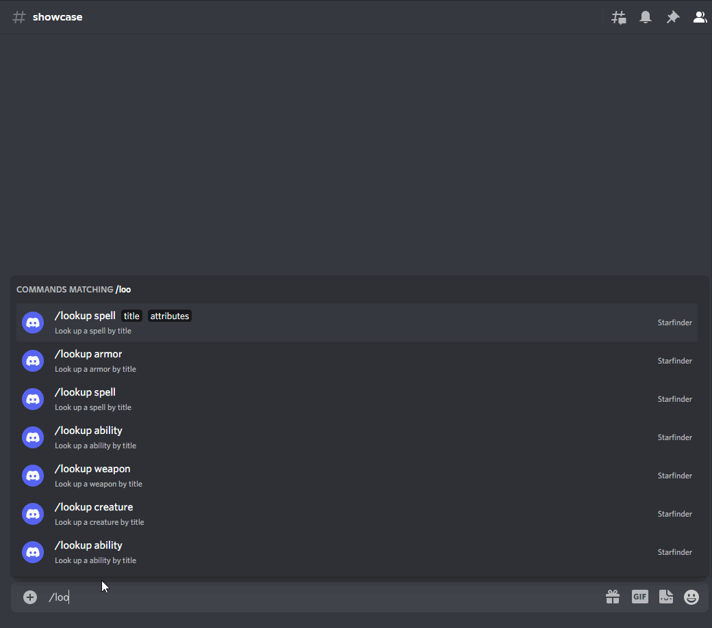
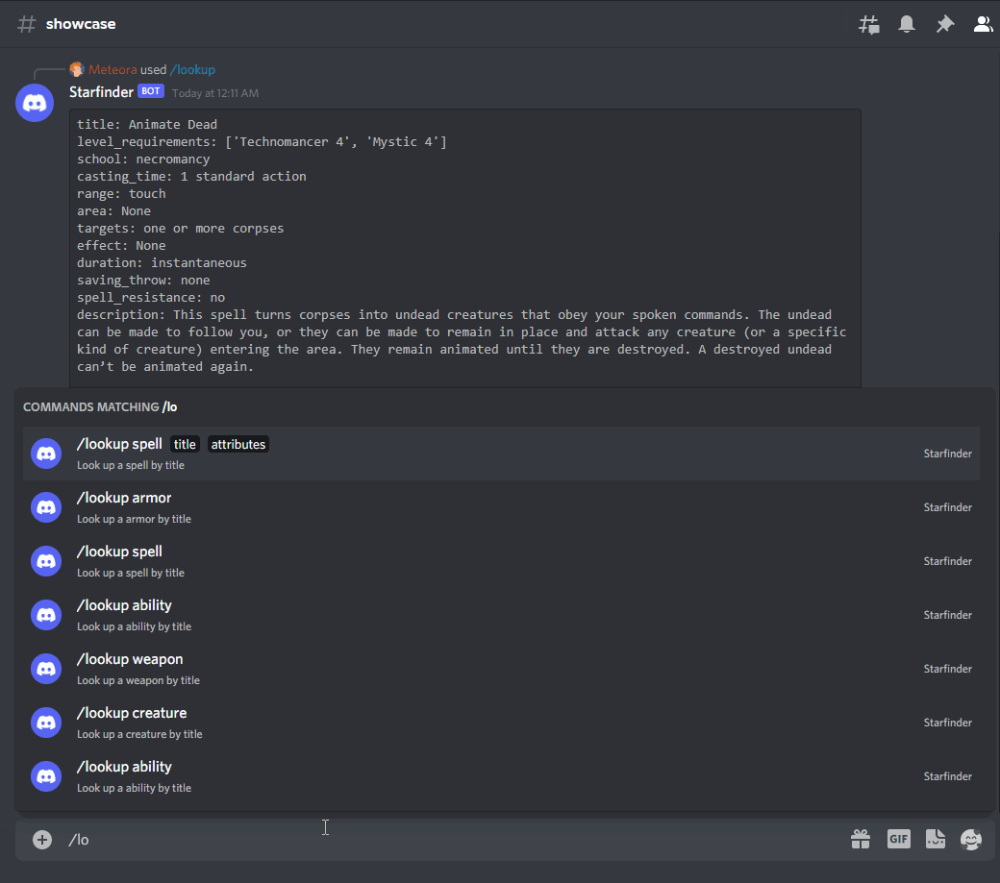

# discord-starfinder

This is to show how we can build a serverless discord slash command bot that returns data about starfinder. Since everything is done via serverless, you only pay when its used.

The basic architecture is:

1. Discord API -> AWS HTTP API Gateway
1. AWS HTTP API Gateway -> Invoke lamba

   - Invoke Lmabda will verify signature of discord API call with values stored in AWS SSM Parameter store

1. Invoke Lambda passes icoming request to eventbridge and uses the discord command as the source

   - Invoke -> EventBus (all starfinder events) -> Event Rule (rule where lookup is the source) -> Lookup Lambda

1. Because the lookup lambda is tied to the event rule that forwards lookup events, it will be invoked when you make a /lookup command in discord. The Invoke lambda will intially respond to discord letting it know that starfinder is "thinking".

1. Lookup lambda will return information to discord based on the parameters provided.

I also provided the "register_commands.py" to show how you register these commands with your own discord bot.

# Examples

## Spell Lookup

If you notice there is a bit of a delay with the frist call. That is because this architecure is serverless, so the very first call will warm up the lambdas (invoke, lookup). The next call is a lot quicker.

## Armor Lookup

# Credits

All of the data for starfinder specially I retrieved from https://api.starfinder.dragonlash.com/
